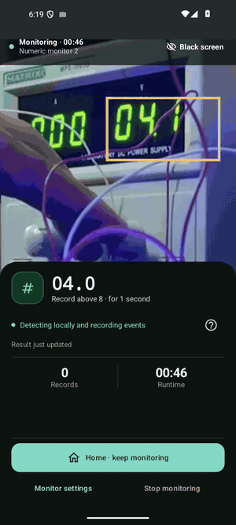
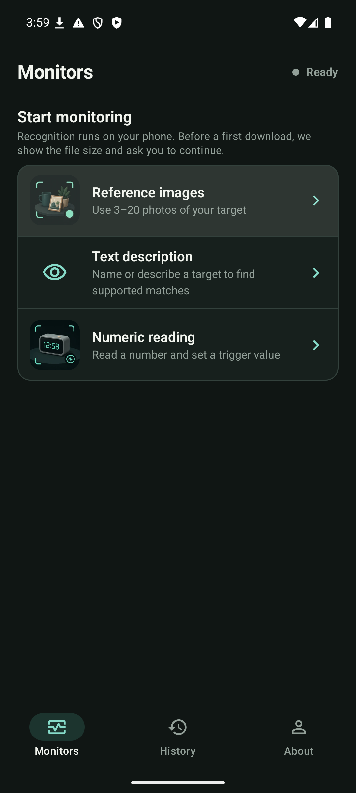
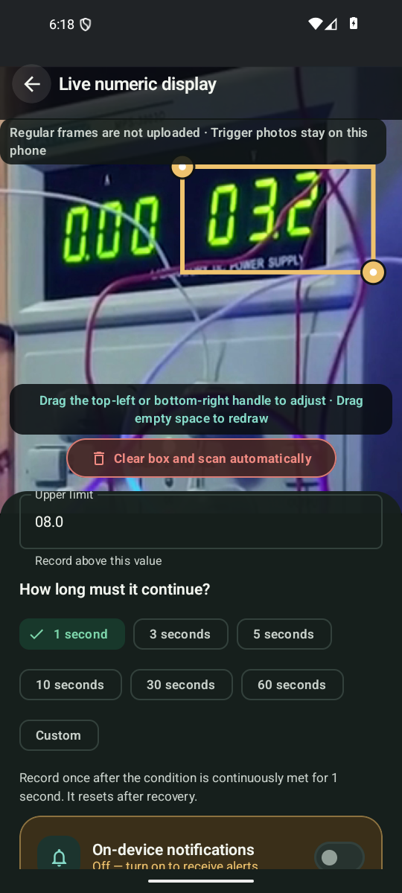
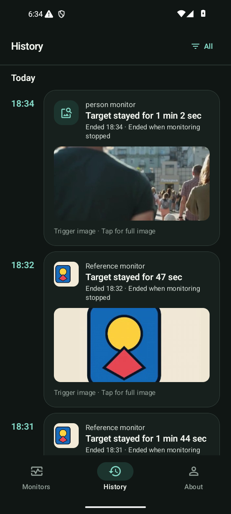
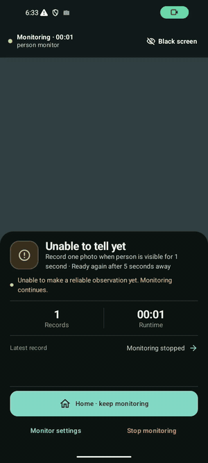
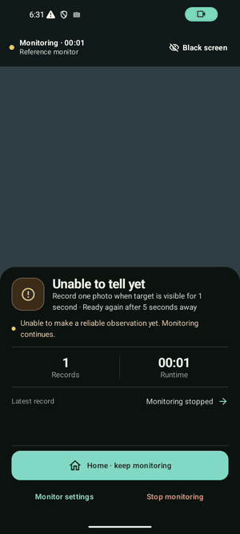
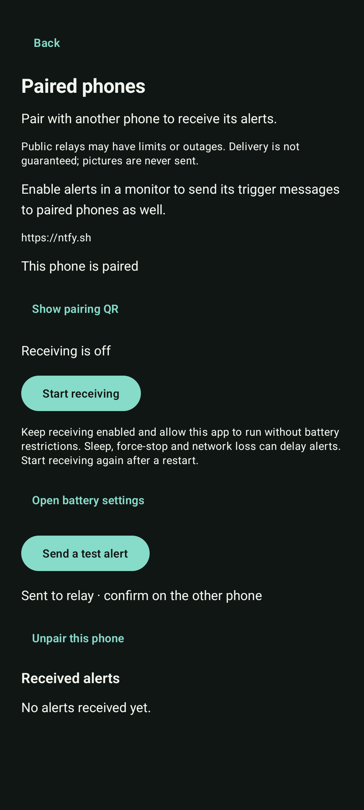
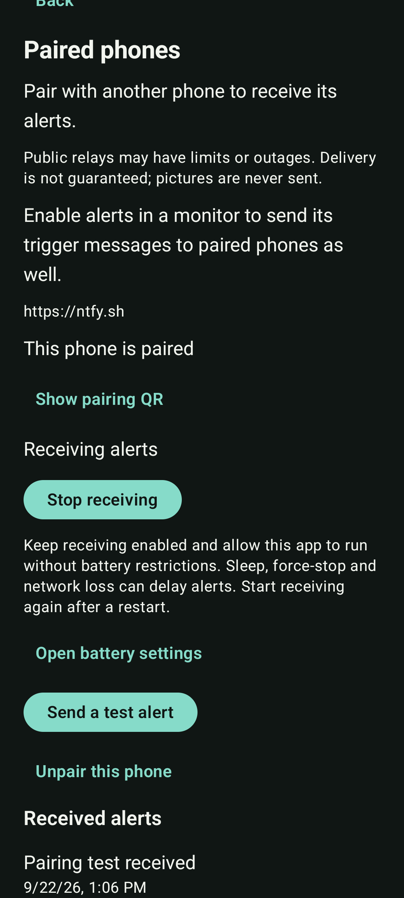

# Be Your Eye

**Turn a spare phone into a visual monitor.**

Point the camera. Set a condition. Get an alert when it happens.

**English** · [简体中文](README.zh-CN.md) · [繁體中文](README.zh-Hant.md) · [日本語](README.ja.md) · [한국어](README.ko.md) · [Español](README.es.md) · [Français](README.fr.md) · [Deutsch](README.de.md) · [Português (Brasil)](README.pt-BR.md)

  

**[Watch the demo](#demo)** · **[Build from source](#get-started)** · [User guide](USER_MANUAL.md)

## Stop checking the display. Let your phone watch it.

<table>
<tr>
<td width="45%" align="center"></td>
<td width="55%">
<h3>A reading crosses 8. Your phone catches it.</h3>

A power-supply display, a camera and one simple rule:

<ol><li>Watch the number on the display.</li><li>Trigger above 8 for one second.</li><li>Record the event at 08.8 and show a local notification.</li></ol>

<a href="https://github.com/Munable/be-your-eye/raw/refs/heads/main/docs/community/demos/numeric.mp4">Watch the 23-second recording</a>

</td>
</tr>
</table>

App recordings on an Android emulator, using replayed footage and an illustrated reference target. These demonstrate the workflow, not real-phone accuracy. [Demo sources and results](docs/community/demos/SOURCES.md).

- **Your camera stays yours.** Recognition runs on the phone; images stay there.
- **No account. No subscription. No API key.** Download the models once, then monitor offline.
- **A history of what happened.** Review events locally, with an optional encrypted text alert to another phone.

## Choose. Set. Monitor.

Choose what to watch, set the condition and keep the app visible. Review the events when you need them.

<table>
<tr><th>Choose a target</th><th>Set a condition</th><th>Review events</th></tr>
<tr><td align="center" width="33%"></td><td align="center" width="33%"></td><td align="center" width="33%"></td></tr>
</table>

## More ways to watch

<table>
<tr><th>Notice when a person appears · Experimental</th><th>Watch for a target from your pictures · Experimental</th></tr>
<tr><td align="center" width="50%"></td><td align="center" width="50%"></td></tr>
<tr><td>Select a supported target from the Catalog. The demo detects people, not identities.</td><td>Provide 3–20 reference pictures. The demo matches an illustrated test target.</td></tr>
</table>

## One phone watches. Another tells you.

Pair phones by QR code. Encrypted text travels through a relay you choose; images stay on the monitoring phone. [Pairing guide](docs/community/PAIRING.md).

<table>
<tr><th>Send an alert</th><th>Receive it on another phone</th></tr>
<tr><td align="center" width="50%"></td><td align="center" width="50%"></td></tr>
</table>

Shown: a test alert between two emulators through a public relay. Delivery depends on the network, relay availability and Android battery settings.

## Try Be Your Eye

**Developer preview — no public APK yet.** Build the Community app and follow the user guide. Releases currently contain model files only.

**[Build from source](docs/community/BUILD.md)** · [User guide](USER_MANUAL.md)

**Monitoring phone:** Android 8+, arm64, 8 GB RAM. Keep it fixed, powered and the app visible. Switching apps or locking stops monitoring.

Numeric reading is the main route; the other two routes are experimental. Supported targets come from a finite Catalog. Real-phone accuracy and sustained reliability remain unverified. Not a safety alarm. [Device requirements and limits](docs/community/DEVICE_SUPPORT.md).

## Help shape it

Try a scene, report a bug or improve a translation. [Contributing](CONTRIBUTING.md) · [Architecture](docs/ARCHITECTURE.md) · [Security](SECURITY.md).

## License

First-party code is [Apache-2.0](LICENSE). [Models](docs/community/MODELS.md), [demo footage](docs/community/demos/SOURCES.md) and [dependencies](THIRD_PARTY_NOTICES.md) retain their own licenses.
